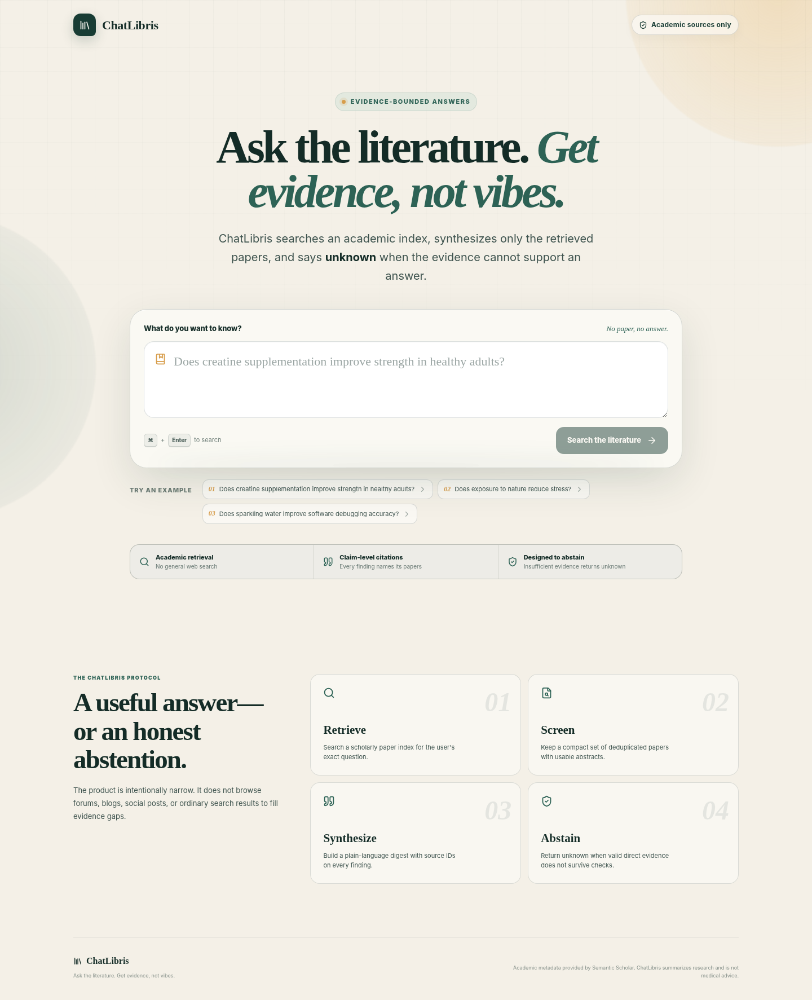

# ChatLibris

> **Ask the literature. Get evidence, not vibes.**

ChatLibris is an evidence-bounded academic question-answering app. It searches scholarly papers, synthesizes only the retrieved evidence, connects every finding to source IDs, and returns **Unknown** when the literature packet cannot support an answer.



## The product loop

```text
Question → academic retrieval → evidence screening → cited synthesis →
Supported / Mixed evidence / Unknown
```

The general web is not searched. The OpenAI model receives the user's question plus a compact packet of paper metadata and abstracts retrieved through Semantic Scholar.

## What is included

- Polished responsive Next.js interface
- Semantic Scholar Academic Graph retrieval
- OpenAI Responses API with Zod-backed Structured Outputs
- Three explicit verdicts: `supported`, `mixed`, and `unknown`
- Deterministic abstention when no usable abstracts are retrieved
- Server-side rejection of invented citation IDs
- Claim-level paper citations
- Search errors kept separate from scientific `unknown` results
- Unit tests, linting, type-checking, and GitHub Actions CI
- Vercel-ready Node.js route configuration

## Stack

- Next.js 16 App Router
- React 19
- TypeScript
- OpenAI JavaScript SDK
- Zod
- Semantic Scholar Academic Graph API
- Vercel Functions

## Run locally

### 1. Install dependencies

```bash
npm install
```

### 2. Create your environment file

```bash
cp .env.example .env.local
```

Fill in at least:

```env
OPENAI_API_KEY=your_key_here
OPENAI_MODEL=gpt-5-mini
```

A Semantic Scholar API key is optional for development, but strongly recommended for a public demo so your project does not rely on shared unauthenticated limits.

```env
SEMANTIC_SCHOLAR_API_KEY=your_optional_key_here
```

### 3. Start the app

```bash
npm run dev
```

Open `http://localhost:3000`.

## Deploy on Vercel

1. Upload this project to a GitHub repository.
2. In Vercel, choose **Add New → Project** and import the repository.
3. Keep the detected Next.js framework settings.
4. Add these Environment Variables:

```text
OPENAI_API_KEY
OPENAI_MODEL=gpt-5-mini
SEMANTIC_SCHOLAR_API_KEY   # recommended
NEXT_PUBLIC_SITE_URL       # your final https://...vercel.app URL
```

5. Deploy.
6. After the first deploy, set `NEXT_PUBLIC_SITE_URL` to the production URL and redeploy so social metadata uses the correct origin.
7. Test the deployed URL in a private browser window.

The API route exports `runtime = "nodejs"` and `maxDuration = 60`, so it deploys as a Vercel Node.js Function with enough time for retrieval and synthesis.

## Upload to GitHub from the command line

```bash
git init
git add .
git commit -m "Build ChatLibris MVP"
git branch -M main
git remote add origin https://github.com/YOUR_USERNAME/chatlibris.git
git push -u origin main
```

## Environment variables

| Variable | Required | Purpose |
|---|---:|---|
| `OPENAI_API_KEY` | Yes | Runs the evidence-bounded synthesis |
| `OPENAI_MODEL` | No | Defaults to `gpt-5-mini` |
| `SEMANTIC_SCHOLAR_API_KEY` | No | Improves Semantic Scholar rate-limit isolation |
| `NEXT_PUBLIC_SITE_URL` | No | Sets the metadata origin; defaults to localhost |

Never prefix secret keys with `NEXT_PUBLIC_`.

## Verification commands

```bash
npm run lint
npm run typecheck
npm test
npm run build
```

Run everything at once:

```bash
npm run check
```

## API contract

### Request

```http
POST /api/answer
Content-Type: application/json
```

```json
{
  "question": "Does creatine supplementation improve strength in healthy adults?"
}
```

### Successful response

```json
{
  "question": "...",
  "result": {
    "status": "supported",
    "confidence": "medium",
    "answer": "...",
    "rationale": "...",
    "directlyRelevantSourceIds": ["P1", "P3"],
    "claims": [
      {
        "statement": "...",
        "sourceIds": ["P1", "P3"]
      }
    ],
    "limitations": ["..."],
    "papersReviewed": 8,
    "generatedAt": "..."
  },
  "papers": [],
  "search": {
    "provider": "Semantic Scholar",
    "totalResults": 100,
    "usablePapers": 8
  },
  "requestId": "..."
}
```

## Evidence safeguards

ChatLibris applies several checks beyond prompting:

1. Papers without usable abstracts are removed.
2. Duplicate titles and DOIs are removed.
3. If no usable paper remains, ChatLibris returns `unknown` without calling the model.
4. The model must return a schema-constrained verdict and exact source IDs.
5. Source IDs not present in the retrieval packet are deleted.
6. A `supported` or `mixed` response without valid direct evidence and cited findings is converted to `unknown`.
7. Confidence is capped at `low` when only one direct paper is available.

Read the fuller design note in [`docs/ARCHITECTURE.md`](docs/ARCHITECTURE.md).

## Honest product language

Good claim:

> ChatLibris searches an academic index and constrains its synthesis to the retrieved paper abstracts.

Avoid:

> ChatLibris proves that no paper exists.

An `unknown` result means the answer was not established by the evidence retrieved in that search. It does not prove the claim is false or that no relevant publication exists elsewhere.

The MVP also does **not** claim “peer-reviewed only,” because an academic index can include journal articles, conference papers, reviews, and preprints. Publication types are displayed when available.

## Demo material

A ready-to-read 60-second script is in [`docs/DEMO.md`](docs/DEMO.md).

## Attribution and disclaimer

Academic metadata is provided by Semantic Scholar. Review the Semantic Scholar API license and terms before expanding beyond a hackathon demo.

ChatLibris summarizes research literature. It is not medical advice and does not provide diagnosis or individualized treatment instructions.

## License

MIT
